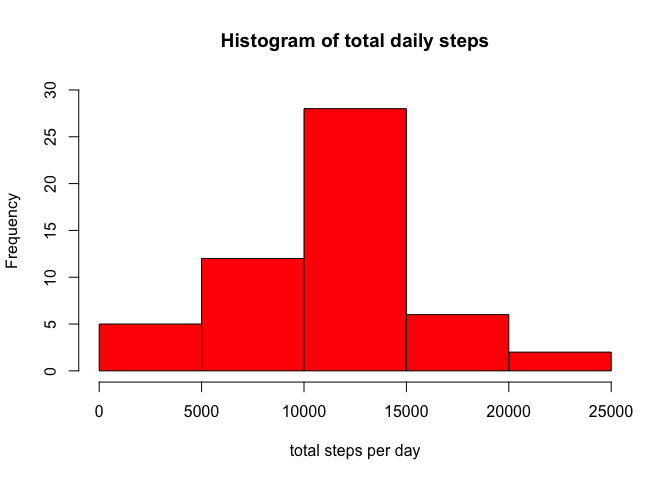
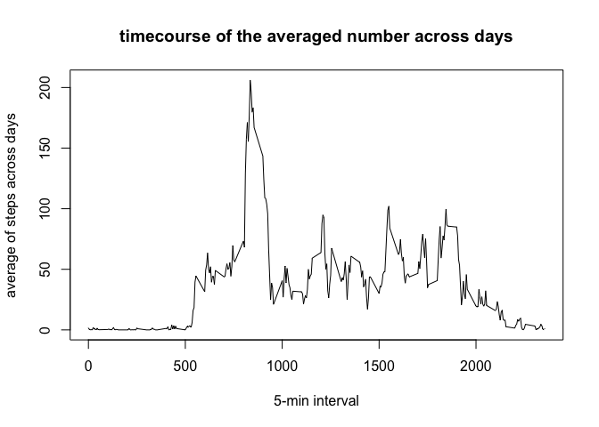
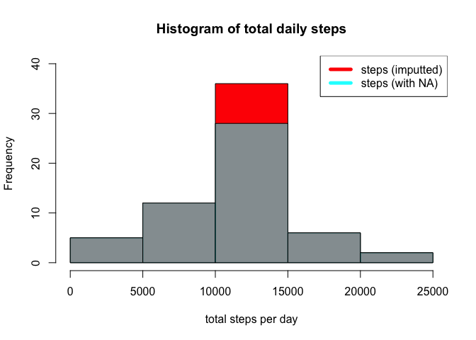
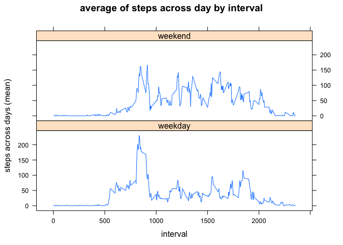

```r
knitr::opts_chunk$set(echo = TRUE, fig.path = "figure/")
```

#prepare data
load libraries and data needed for the assignement, have a first look at the data,
and transform the column including dates in a date format.


```r
#library(ggplot2)
library(lattice)

rawData <- read.csv("activity.csv")

head(rawData)
```

```
##   steps       date interval
## 1    NA 2012-10-01        0
## 2    NA 2012-10-01        5
## 3    NA 2012-10-01       10
## 4    NA 2012-10-01       15
## 5    NA 2012-10-01       20
## 6    NA 2012-10-01       25
```

```r
summary(rawData)
```

```
##      steps                date          interval     
##  Min.   :  0.00   2012-10-01:  288   Min.   :   0.0  
##  1st Qu.:  0.00   2012-10-02:  288   1st Qu.: 588.8  
##  Median :  0.00   2012-10-03:  288   Median :1177.5  
##  Mean   : 37.38   2012-10-04:  288   Mean   :1177.5  
##  3rd Qu.: 12.00   2012-10-05:  288   3rd Qu.:1766.2  
##  Max.   :806.00   2012-10-06:  288   Max.   :2355.0  
##  NA's   :2304     (Other)   :15840
```

```r
str(rawData)
```

```
## 'data.frame':	17568 obs. of  3 variables:
##  $ steps   : int  NA NA NA NA NA NA NA NA NA NA ...
##  $ date    : Factor w/ 61 levels "2012-10-01","2012-10-02",..: 1 1 1 1 1 1 1 1 1 1 ...
##  $ interval: int  0 5 10 15 20 25 30 35 40 45 ...
```

```r
lapply(rawData, class)
```

```
## $steps
## [1] "integer"
## 
## $date
## [1] "factor"
## 
## $interval
## [1] "integer"
```

```r
rawData$date <- as.Date(rawData$date, format = "%Y-%m-%d")
```

#total steps by day

calculate the total of steps by day


```r
aggregatedSteps <- aggregate(steps ~ date, rawData, sum)
```

do a histogram of the total of steps by day


```r
hist(aggregatedSteps$steps, xlab = "total steps per day", 
     col = "red", xlim = c(0,25000), ylim = c(0,30), 
     main = "Histogram of total daily steps")
```

<!-- -->

calculate the mean and median total steps


```r
meanTotSteps <- mean(aggregatedSteps$steps)
medianTotSteps <- median(aggregatedSteps$steps)
descriptiveSteps <- c(meanTotSteps, medianTotSteps)
descriptiveSteps
```

```
## [1] 10766.19 10765.00
```

#average steps by interval

calculate the average of steps by interval across days


```r
StepsByInterval <- aggregate(steps ~ interval, rawData, mean)
```

do a line plot of the averaged number of steps by interval


```r
plot(StepsByInterval$interval, StepsByInterval$steps, type = "l", 
     xlab = "5-min interval", ylab = "average of steps across days", 
     main = "timecourse of the averaged number across days")
```

<!-- -->

find the maximal number of steps across interval


```r
maxInterval <- StepsByInterval[which.max(StepsByInterval$steps),1]
maxInterval
```

```
## [1] 835
```

#imputing nas and working with the new dataset

define the number of missing values (NAs)


```r
total_na <- nrow(rawData[is.na(rawData$steps),])
```

create a new dataset with a new column in which the NAs are replaced by 
the average of steps by interval across days


```r
data_noNA <- rawData
meanStepsInterval <- aggregate(steps ~ interval, data_noNA, mean)
for (i in 1:nrow(data_noNA)){
    if (is.na(data_noNA[i,1]) == TRUE){
        naInterval <- data_noNA[i,3]
        data_noNA[i,"steps_imputted"] <- meanStepsInterval[
            which(meanStepsInterval[,"interval"] %in% naInterval),2]
    } else {
        data_noNA[i,"steps_imputted"] <- data_noNA[i, "steps"]
    }
}
```

##total number of steps by day in imputted data and difference with non-imputted
##data

calculate the total number of steps in the data with the NAs and 
in the data with the NAs replaced


```r
totalSteps_noNA <- aggregate(steps_imputted ~ date, data_noNA, sum)
totalSteps_NA <- aggregate(steps ~ date, data_noNA, sum)
```

to see the difference between the imputted and non-imputted data:
create a histogram of the total number of steps by day, layering the 
non-imputted data (cyan) in top of the imputted data (red)


```r
hist(totalSteps_noNA$steps, xlab = "total steps per day", 
     col = "red",ylim = c(0,40),
     main = "Histogram of total daily steps",
     breaks = 5)
hist(totalSteps_NA$steps, col = rgb(0,1,1,0.55), add = TRUE, 
     breaks = 5)
legend("topright", col = c("red", "cyan"), lwd = 5,
       legend = c("steps (imputted)","steps (with NA)"))
```

<!-- -->

Calculate and report the mean and median total number of steps taken per day.


```r
meanTotSteps_noNA <- mean(totalSteps_noNA$steps)
medianTotSteps_noNA <- median(totalSteps_noNA$steps)
descriptiveSteps_noNA <- c(meanTotSteps_noNA, medianTotSteps_noNA)
descriptiveSteps_noNA
```

```
## [1] 10766.19 10766.19
```

```r
diff_meanSteps <- meanTotSteps_noNA - meanTotSteps
diff_medianSteps <- medianTotSteps_noNA - medianTotSteps
diff_meanSteps
```

```
## [1] 0
```

```r
diff_medianSteps
```

```
## [1] 1.188679
```

##define weekdays and weekends

create a new variable in imputted data coding for the day of the week
and another variable for the type of day (weekday/weekend)


```r
for (i in 1:nrow(data_noNA)){
    data_noNA[i,"day"] <- weekdays(data_noNA[i,"date"])
}

data_noNA$weekday <- ifelse((data_noNA$day == "Saturday" | 
                            data_noNA$day == "Sunday"), "weekend", "weekday")
```

create a panel line plot of the average number of steps by interval 
(one panel for weekend and one for weekday)


```r
stepsByDaytype <- aggregate(steps_imputted ~ interval + weekday, data = data_noNA, 
                           FUN = mean)

xyplot(x= steps_imputted ~ interval | weekday, data = stepsByDaytype, 
       type = "l", layout = c(1,2), ylab = "steps across days (mean)",
       main = "average of steps across day by interval")     
```

<!-- -->
